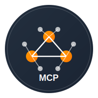
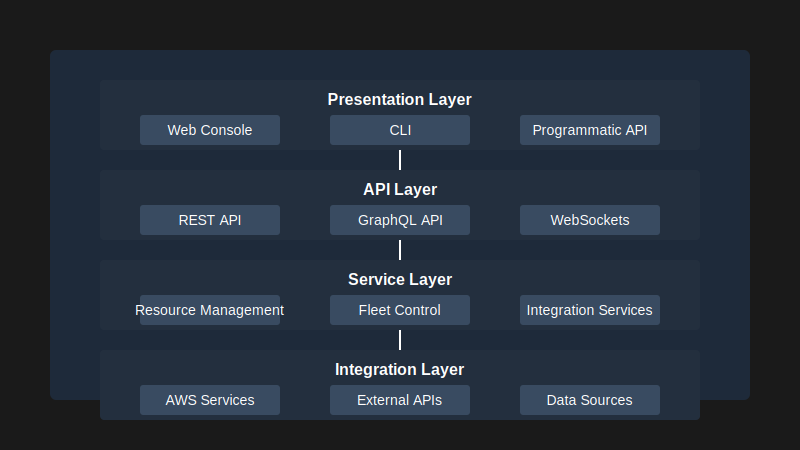
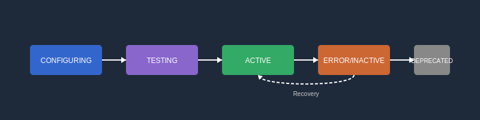

<div align="center">
  
  
  # AWS MCP Server
  
  ### Fleet Management and Integration Framework
  
  [](https://github.com/risklogicgroup/aws-mcp-server)
  [](https://codecov.io/gh/risklogicgroup/aws-mcp-server)
  [](https://www.python.org/downloads/)
  [](LICENSE)
  [](https://docs.risklogicgroup.com/aws-mcp-server)

  <p><strong>A comprehensive solution for managing AWS resources at scale with powerful integration capabilities</strong></p>
  
  <p>
    <a href="#getting-started">Quick Start</a> • 
    <a href="#architecture-overview">Architecture</a> • 
    <a href="#integration-framework">Integration Framework</a> • 
    <a href="#deployment">Deployment</a> • 
    <a href="#api-reference">API Reference</a> • 
    <a href="#contributing">Contributing</a>
  </p>
</div>

<hr/>

## Overview

AWS MCP Server provides organizations with a centralized control plane for managing AWS resources across multiple accounts, regions, and services. The platform features a robust integration framework that enables seamless connectivity with external systems through multiple protocols and authentication mechanisms.

<table>
  <tr>
    <td width="50%">
      <h4>Key Features</h4>
      <ul>
        <li>Multi-account resource management</li>
        <li>Advanced integration capabilities with health monitoring</li>
        <li>Asynchronous architecture for high performance</li>
        <li>Sophisticated retry mechanisms and fault tolerance</li>
        <li>Comprehensive authentication options</li>
        <li>Extensible plugin system</li>
      </ul>
    </td>
    <td width="50%">
      <h4>Use Cases</h4>
      <ul>
        <li>Enterprise AWS resource governance</li>
        <li>Automated cloud operations</li>
        <li>Integration with ITSM and CMDB systems</li>
        <li>Custom workflow automation</li>
        <li>Cross-account resource orchestration</li>
        <li>DevOps pipeline integration</li>
      </ul>
    </td>
  </tr>
</table>

---

## Getting Started

### Prerequisites

- Python 3.9 or higher
- AWS CLI configured with appropriate permissions
- Docker (for containerized deployment)

### Quick Installation

```bash
# Clone the repository
git clone https://github.com/risklogicgroup/aws-mcp-server.git

# Change to the project directory
cd aws-mcp-server

# Install the package
pip install -e .

# Start the server
python -m aws_mcp_server.server
```

### First Integration Example

```python
from aws_mcp_server.fleet_management.integrations.integration import (
    IntegrationConfig, IntegrationType, Direction, AuthConfig, AuthType
)

# Configure a REST API integration
config = IntegrationConfig(
    name="ServiceNow CMDB",
    description="Integration with ServiceNow CMDB for asset tracking",
    type=IntegrationType.REST_API,
    direction=Direction.BIDIRECTIONAL,
    auth=AuthConfig(
        type=AuthType.BASIC,
        credentials_key="servicenow_credentials",
        config={
            "username_field": "username",
            "password_field": "password"
        }
    )
)

# Register the integration
integration_id = await registry.register_integration(config)
```

For more examples, see the [Examples](./examples/) directory.

---

## Architecture Overview

<div align="center">
  
</div>

AWS MCP Server employs a modular, layered architecture designed for flexibility, maintainability, and scalability:

<table>
  <tr>
    <th>Layer</th>
    <th>Components</th>
    <th>Responsibility</th>
  </tr>
  <tr>
    <td><strong>Presentation</strong></td>
    <td>Web Console, CLI, Programmatic API</td>
    <td>User interfaces and client libraries</td>
  </tr>
  <tr>
    <td><strong>API</strong></td>
    <td>REST API, GraphQL API, WebSockets</td>
    <td>Service interface and protocol handling</td>
  </tr>
  <tr>
    <td><strong>Service</strong></td>
    <td>Resource Management, Fleet Control, Integration Services</td>
    <td>Business logic and orchestration</td>
  </tr>
  <tr>
    <td><strong>Integration</strong></td>
    <td>AWS Services, External APIs, Data Sources</td>
    <td>External connectivity and data exchange</td>
  </tr>
</table>

### Design Principles

- **Asynchronous First**: Built on asyncio for non-blocking I/O and high concurrency
- **Domain-Driven Design**: Components organized around business domains
- **Resilience by Design**: Built-in fault tolerance and recovery mechanisms
- **Secure by Default**: Security controls integrated into core components
- **Observability**: Comprehensive logging, metrics, and tracing

---

## Integration Framework

The integration framework is the backbone of AWS MCP Server's connectivity capabilities, enabling communication with a wide range of external systems.

### Supported Integration Types

<div class="integration-grid">
  <table>
    <tr>
      <th>Type</th>
      <th>Description</th>
      <th>Use Cases</th>
    </tr>
    <tr>
      <td><code>REST_API</code></td>
      <td>RESTful API integrations with JSON/XML support</td>
      <td>Most modern SaaS platforms, ITSM systems</td>
    </tr>
    <tr>
      <td><code>WEBHOOK</code></td>
      <td>HTTP callbacks for push-based notifications</td>
      <td>Event notifications, triggers, alerting</td>
    </tr>
    <tr>
      <td><code>GRAPHQL</code></td>
      <td>GraphQL API integrations for flexible data queries</td>
      <td>Complex data retrieval, modern APIs</td>
    </tr>
    <tr>
      <td><code>GRPC</code></td>
      <td>High-performance RPC services using Protocol Buffers</td>
      <td>Microservice communication, high-throughput data exchange</td>
    </tr>
    <tr>
      <td><code>EVENT_BUS</code></td>
      <td>Pub/sub message bus integrations</td>
      <td>Event-driven architectures, Kafka, RabbitMQ</td>
    </tr>
  </table>
</div>

### Integration Lifecycle

Integrations follow a well-defined lifecycle that ensures proper initialization, monitoring, and graceful shutdown:

<div align="center">
  
</div>


```
CONFIGURING → TESTING → ACTIVE → ERROR/INACTIVE → DEPRECATED
```

### Authentication Options

The framework supports multiple authentication mechanisms to secure integration endpoints:

```python
# OAuth2 Authentication Example
auth_config = AuthConfig(
    type=AuthType.OAUTH2,
    credentials_key="github_oauth",
    config={
        "token_url": "https://github.com/login/oauth/access_token",
        "client_id_field": "client_id",
        "client_secret_field": "client_secret",
        "scope": "repo,user"
    }
)
```

### Health Monitoring

Proactive health checks ensure integrations remain operational:

```python
# Custom Health Check Configuration
health_check = HealthCheckConfig(
    enabled=True,
    interval_seconds=60,  # Check every minute
    failure_threshold=3,  # Mark as ERROR after 3 failures
    endpoint="/api/health",
    expected_status_code=200
)
```

The system automatically:
- Conducts periodic health checks based on configuration
- Detects and reports failures
- Attempts recovery from transient issues
- Updates integration status based on health results

---

## API Reference

AWS MCP Server provides comprehensive APIs for managing resources and integrations:

### Resource Management

```http
GET /api/v1/resources
GET /api/v1/resources/{resource_id}
POST /api/v1/resources
PUT /api/v1/resources/{resource_id}
DELETE /api/v1/resources/{resource_id}
```

### Integration Management

```http
GET /api/v1/integrations
GET /api/v1/integrations/{integration_id}
POST /api/v1/integrations
PUT /api/v1/integrations/{integration_id}
DELETE /api/v1/integrations/{integration_id}
GET /api/v1/integrations/{integration_id}/health
POST /api/v1/integrations/{integration_id}/test
```

Complete API documentation is available in [OpenAPI format](./docs/api.yaml).

---

## Development Guide

### Project Structure

```
aws-mcp-server/
├── src/
│   └── aws_mcp_server/
│       ├── cli_executor.py       # AWS CLI execution utility
│       ├── server.py             # Main server application
│       ├── config.py             # Configuration management
│       ├── fleet_management/     # Fleet management module
│       │   ├── models.py         # Data models
│       │   ├── api/              # API layer
│       │   └── integrations/     # Integration framework
│       │       ├── integration.py # Base integration classes
│       │       ├── rest.py       # REST API integration
│       │       └── ...           # Other integration types
├── tests/                        # Test suite
├── examples/                     # Example code
├── docs/                         # Documentation
└── scripts/                      # Utility scripts
```

### Creating a Custom Integration

```python
# src/aws_mcp_server/fleet_management/integrations/custom.py
from .integration import Integration, IntegrationType

class CustomIntegration(Integration):
    """Custom integration implementation."""
    
    async def initialize(self) -> bool:
        """Initialize the custom integration."""
        self.client = MyCustomClient(self.config.metadata.get("connection_string"))
        await self.client.connect()
        return await super().initialize()
    
    async def health_check(self) -> bool:
        """Perform a health check."""
        try:
            status = await self.client.check_status()
            return status.is_healthy
        except Exception as e:
            self.logger.error(f"Health check failed: {str(e)}")
            return False
    
    async def shutdown(self) -> None:
        """Clean up resources."""
        await self.client.disconnect()
        await super().shutdown()

# Register the integration type
async def register(registry):
    await registry.register_plugin_type(
        IntegrationType.CUSTOM,
        CustomIntegration
    )
```

## Deployment

### Docker Deployment

Deploy AWS MCP Server using Docker:

```bash
# Build the Docker image
docker build -t aws-mcp-server .

# Run the container
docker run -d \
  --name mcp-server \
  -p 8000:8000 \
  -v $(pwd)/config.yaml:/app/config.yaml \
  -e AWS_ACCESS_KEY_ID=${AWS_ACCESS_KEY_ID} \
  -e AWS_SECRET_ACCESS_KEY=${AWS_SECRET_ACCESS_KEY} \
  aws-mcp-server
```

### AWS Deployment Options

<table>
  <tr>
    <th width="20%">Service</th>
    <th>Configuration</th>
    <th>Best For</th>
  </tr>
  <tr>
    <td><strong>ECS</strong></td>
    <td>
      <ul>
        <li>Fargate or EC2 launch type</li>
        <li>Application Load Balancer</li>
        <li>Auto Scaling</li>
      </ul>
    </td>
    <td>Production workloads requiring high availability and scalability</td>
  </tr>
  <tr>
    <td><strong>EKS</strong></td>
    <td>
      <ul>
        <li>Kubernetes deployment</li>
        <li>Helm charts available</li>
        <li>Horizontal Pod Autoscaler</li>
      </ul>
    </td>
    <td>Organizations standardized on Kubernetes</td>
  </tr>
  <tr>
    <td><strong>Lambda + API Gateway</strong></td>
    <td>
      <ul>
        <li>Serverless deployment</li>
        <li>API components as Lambda functions</li>
        <li>DynamoDB for state</li>
      </ul>
    </td>
    <td>Serverless architecture with minimal operational overhead</td>
  </tr>
</table>

## Security Considerations

AWS MCP Server implements multiple security controls:

- **Authentication**: Multi-factor authentication for administrative access
- **Authorization**: Fine-grained RBAC for API endpoints
- **Encryption**: Data encryption in transit and at rest
- **Secrets Management**: Integration with AWS Secrets Manager
- **Audit Logging**: Comprehensive audit trail for compliance

## Roadmap

The following roadmap outlines the planned development and remaining components of the AWS MCP Server project:

<table>
  <tr>
    <th>Phase</th>
    <th>Components</th>
    <th>Status</th>
  </tr>
  <tr>
    <td><strong>Q1 2025</strong></td>
    <td>
      <ul>
        <li>Specialized Integration Implementations</li>
        <ul>
          <li>REST API Integration</li>
          <li>Webhook Integration</li>
          <li>GraphQL Integration</li>
          <li>gRPC Integration</li>
        </ul>
        <li>Integration Testing Framework</li>
        <li>API Endpoint Documentation</li>
      </ul>
    </td>
    <td>In Progress</td>
  </tr>
  <tr>
    <td><strong>Q2 2025</strong></td>
    <td>
      <ul>
        <li>Web Console UI</li>
        <ul>
          <li>Integration Dashboard</li>
          <li>Configuration Wizard</li>
          <li>Health Monitoring</li>
        </ul>
        <li>Message Queue Integration</li>
        <li>Event Bus Integration</li>
        <li>Comprehensive Authentication Providers</li>
      </ul>
    </td>
    <td>Planned</td>
  </tr>
  <tr>
    <td><strong>Q3 2025</strong></td>
    <td>
      <ul>
        <li>Advanced Deployment Options</li>
        <li>Enhanced Security Features</li>
        <ul>
          <li>Role-Based Access Control</li>
          <li>Audit Logging</li>
          <li>Compliance Reporting</li>
        </ul>
        <li>Integration Marketplace</li>
        <li>Performance Optimization</li>
      </ul>
    </td>
    <td>Planned</td>
  </tr>
  <tr>
    <td><strong>Q4 2025</strong></td>
    <td>
      <ul>
        <li>AI-Powered Recommendations</li>
        <li>Cross-Account Orchestration</li>
        <li>Custom Workflow Builder</li>
        <li>Enterprise-Grade Scaling</li>
        <li>High Availability Configuration</li>
      </ul>
    </td>
    <td>Planned</td>
  </tr>
</table>

## Troubleshooting

### Common Issues

<div class="troubleshooting">
  <h4>Integration Connection Failures</h4>
  <p><strong>Symptoms:</strong> Integration status shows ERROR, connectivity issues in logs</p>
  <p><strong>Solutions:</strong></p>
  <ol>
    <li>Verify network connectivity between AWS MCP Server and the target system</li>
    <li>Check authentication credentials and permissions</li>
    <li>Ensure firewall rules allow required traffic</li>
    <li>Review VPC configuration if running in AWS</li>
  </ol>
  
  <h4>Performance Degradation</h4>
  <p><strong>Symptoms:</strong> Slow API responses, high resource utilization</p>
  <p><strong>Solutions:</strong></p>
  <ol>
    <li>Enable performance monitoring with AWS X-Ray</li>
    <li>Scale up server resources (CPU/memory)</li>
    <li>Optimize database queries</li>
    <li>Implement caching for frequently accessed data</li>
  </ol>
</div>

### Logging

AWS MCP Server uses Python's logging module with structured logging:

```python
import logging
import json

class StructuredLogFormatter(logging.Formatter):
    def format(self, record):
        log_record = {
            "timestamp": self.formatTime(record),
            "level": record.levelname,
            "message": record.getMessage(),
            "logger": record.name
        }
        
        if hasattr(record, "integration_id"):
            log_record["integration_id"] = record.integration_id
            
        return json.dumps(log_record)
```

## Contributing

We welcome contributions from the community! See [CONTRIBUTING.md](./CONTRIBUTING.md) for details on how to get started.

## License

This project is licensed under the MIT License - see the [LICENSE](LICENSE) file for details.

---

<div align="center">
  <p>
    <a href="https://risklogicgroup.com">Risk Logic Group</a> •
    <a href="https://github.com/risklogicgroup/aws-mcp-server">GitHub</a> •
    <a href="https://docs.risklogicgroup.com/aws-mcp-server">Documentation</a> •
    <a href="https://risklogicgroup.com/community">Community</a>
  </p>
  <p><small>Copyright © 2025 <a href="https://risklogicgroup.com">Risk Logic Group LLC</a>. All rights reserved.</small></p>
</div>
