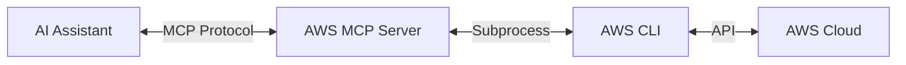
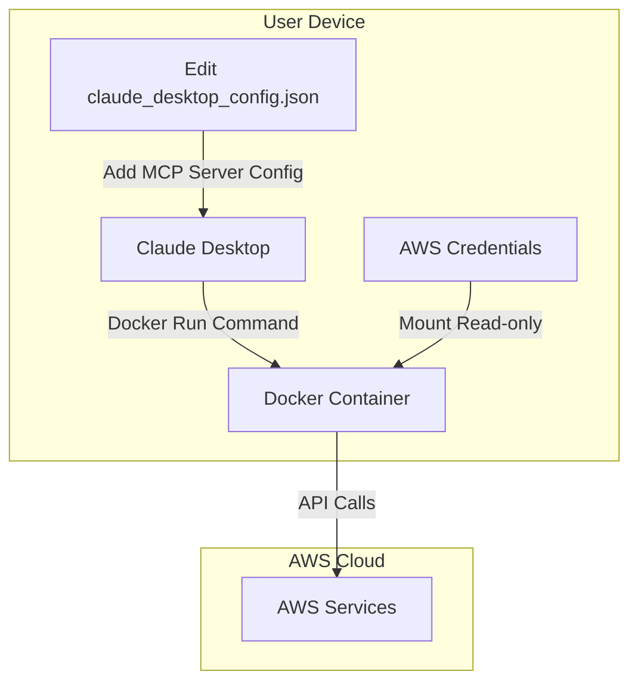

# AWS Model Context Protocol (MCP) Server

A lightweight service that enables AI assistants to execute AWS CLI commands through the Model Context Protocol (MCP).

## Overview

The AWS MCP Server provides a bridge between MCP-aware AI assistants (like Claude Desktop, Cursor, Windsurf) and the AWS CLI. It enables these assistants to:

1. **Retrieve AWS CLI documentation** - Get detailed help on AWS services and commands
2. **Execute AWS CLI commands** - Run commands and receive formatted results optimized for AI consumption



The video demonstrates using Claude Desktop with AWS MCP Server to create a new AWS EC2 instance with AWS SSM agent installed.

## Features

- **Command Documentation** - Detailed help information for AWS CLI commands
- **Command Execution** - Execute AWS CLI commands and return human-readable results
- **Unix Pipe Support** - Filter and transform AWS CLI output using standard Unix pipes and utilities
- **Prompt Templates** - Pre-defined prompt templates for common AWS tasks following best practices
- **Docker Integration** - Simple deployment through containerization with multi-architecture support (AMD64/x86_64 and ARM64)
- **AWS Authentication** - Leverages existing AWS credentials on the host machine

## Requirements

- Docker (default) or Python 3.13+ (and AWS CLI installed locally)
- AWS credentials configured

## Getting Started

### Option 1: Using Docker (Recommended)

```bash
# Clone repository
git clone https://github.com/uakbr/aws-mcp.git
cd aws-mcp

# Build and run Docker container
docker compose -f deploy/docker/docker-compose.yml up -d
```

The Docker image supports both AMD64/x86_64 (Intel/AMD) and ARM64 (Apple Silicon M1-M4, AWS Graviton) architectures.

> **Note**: The official image from GitHub Packages is multi-architecture and will automatically use the appropriate version for your system.
>
> ```bash
> # Use the latest stable version
> docker pull ghcr.io/alexei-led/aws-mcp-server:latest
> 
> # Or pin to a specific version (recommended for production)
> docker pull ghcr.io/alexei-led/aws-mcp-server:1.0.0
> ```
>
> **Docker Image Tags**:
>
> - `latest`: Latest stable release
> - `x.y.z` (e.g., `1.0.0`): Specific version
> - `sha-abc123`: Development builds, tagged with Git commit SHA

### Option 2: Using Python

```bash
# Clone repository
git clone https://github.com/alexei-led/aws-mcp-server.git
cd aws-mcp-server

# Set up virtual environment
python -m venv venv
source venv/bin/activate  # On Windows: venv\Scripts\activate

# Install in development mode
pip install -e .

# Run the server
python -m aws_mcp_server
```

## Configuration

The AWS MCP Server can be configured using environment variables:

| Environment Variable | Description | Default |
|---------------------|-------------|---------|
| `AWS_MCP_TIMEOUT` | Command execution timeout in seconds | 300 |
| `AWS_MCP_MAX_OUTPUT` | Maximum output size in characters | 100000 |
| `AWS_MCP_TRANSPORT` | Transport protocol to use ("stdio" or "sse") | stdio |
| `AWS_PROFILE` | AWS profile to use | default |
| `AWS_REGION` | AWS region to use | us-east-1 |

## Integrating with Claude Desktop

To integrate AWS MCP Server with Claude Desktop, you'll need to edit the Claude Desktop configuration file:

1. **Locate the Claude Desktop configuration file**:
   - macOS: `~/Library/Application Support/Claude/claude_desktop_config.json`
   - Windows: `%APPDATA%\Claude\claude_desktop_config.json`

2. **Edit the configuration file** to include the AWS MCP Server:
   ```json
   {
     "mcpServers": {
       "aws-mcp-server": {
         "command": "docker",
         "args": [
           "run",
           "-i",
           "--rm",
           "-v",
           "/Users/YOUR_USER_NAME/.aws:/home/appuser/.aws:ro",
           "ghcr.io/alexei-led/aws-mcp-server:latest"
         ]
       }
     }
   }
   ```

3. **Restart Claude Desktop** to apply the changes
   - After restarting, you should see a hammer 🔨 icon in the bottom right corner of the input box
   - This indicates that the AWS MCP Server is available for use



### Example Interactions

**Getting AWS CLI Documentation**:
```
User: What are the available options for the AWS S3 cp command?

Claude: Let me get that information for you.

The AWS S3 cp command has the following options:

NAME
    cp - Copies a local file or S3 object to another location locally or in S3.

SYNOPSIS
    cp <LocalPath> <S3Uri> or <S3Uri> <LocalPath> or <S3Uri> <S3Uri> [--acl <value>] [--cache-control <value>] ...
```

**Executing AWS CLI Commands**:
```
User: List my S3 buckets

Claude: I'll list your S3 buckets for you.

2023-10-15 14:30:45 my-bucket-1
2023-11-20 09:15:32 my-bucket-2
2024-01-05 11:22:18 my-backup-bucket
```

**Using Command Pipes**:
```
User: List my S3 buckets that have "backup" in their name and show them in alphabetical order

Claude: Let me find that for you.

2024-01-05 11:22:18 my-backup-bucket
2024-03-01 09:44:12 weekly-backup-bucket
2024-03-15 13:10:57 database-backup-bucket
```

**Using Prompt Templates**:
```
User: I need to perform a security audit of my S3 buckets

Claude: I'll help you audit the security of your S3 buckets.

Here are AWS CLI commands to perform a comprehensive security audit:

# List all buckets with public access settings
aws s3api list-buckets --query 'Buckets[*].Name' --output text | xargs -I {} aws s3api get-public-access-block --bucket {}

# Check bucket policies for public access
aws s3api list-buckets --query 'Buckets[*].Name' --output text | xargs -I {} aws s3api get-bucket-policy --bucket {} 2>/dev/null

# Identify buckets without encryption
aws s3api list-buckets --query 'Buckets[*].Name' --output text | xargs -I {} aws s3api get-bucket-encryption --bucket {} 2>/dev/null

# Check for buckets without logging enabled
aws s3api list-buckets --query 'Buckets[*].Name' --output text | xargs -I {} aws s3api get-bucket-logging --bucket {} 2>/dev/null

# Verify bucket versioning status
aws s3api list-buckets --query 'Buckets[*].Name' --output text | xargs -I {} aws s3api get-bucket-versioning --bucket {}
```

## Available Prompt Templates

The AWS MCP Server includes the following pre-defined prompt templates:

| Prompt | Description | Parameters |
|--------|-------------|------------|
| `create_resource` | Generate commands to create AWS resources with best practices | `resource_type`, `resource_name` |
| `security_audit` | Audit security settings for a specific AWS service | `service` |
| `cost_optimization` | Find cost optimization opportunities for a service | `service` |
| `resource_inventory` | Create comprehensive inventory of resources | `service`, `region` (optional) |
| `troubleshoot_service` | Generate commands to troubleshoot service issues | `service`, `resource_id` |
| `iam_policy_generator` | Create least-privilege IAM policies | `service`, `actions`, `resource_pattern` (optional) |
| `service_monitoring` | Set up comprehensive monitoring | `service`, `metric_type` (optional) |
| `disaster_recovery` | Implement disaster recovery solutions | `service`, `recovery_point_objective` (optional) |
| `compliance_check` | Check compliance with standards | `compliance_standard`, `service` (optional) |
| `resource_cleanup` | Identify and safely clean up resources | `service`, `criteria` (optional) |

## Security

- The server uses AWS credentials from the host machine
- All commands are validated before execution
- Timeout limits prevent long-running commands
- Commands must start with the 'aws' prefix
- Potentially dangerous commands are restricted

## Development

### Setting Up the Development Environment

```bash
# Install only runtime dependencies
pip install -e .

# Install all development dependencies
pip install -e ".[dev]"

# Run unit tests
pytest -k "not integration"

# Run tests with coverage report
pytest -k "not integration" --cov-report=html

# Run linting
ruff check src/ tests/

# Run formatting
ruff format src/ tests/
```

### Code Coverage

The project includes configuration for [Codecov](https://codecov.io) to track code coverage metrics. The configuration is in the `codecov.yml` file, which:

- Sets a target coverage threshold of 80%
- Excludes test files, setup files, and documentation from coverage reports
- Configures PR comments and status checks

Coverage reports are automatically generated during CI/CD runs and uploaded to Codecov.

### Integration Testing

Integration tests verify AWS MCP Server works correctly with actual AWS resources. To run them:

1. **Set up AWS resources**:
   - Create an S3 bucket for testing
   - Set the environment variable: `export AWS_TEST_BUCKET=your-test-bucket-name`
   - Ensure your AWS credentials are configured

2. **Run integration tests**:
   ```bash
   # Run all tests including integration tests
   pytest --run-integration
   
   # Run only integration tests
   pytest --run-integration -m integration
   ```

## Troubleshooting

- **Authentication Issues**: Ensure your AWS credentials are properly configured
- **Connection Errors**: Verify the server is running and AI assistant connection settings are correct
- **Permission Errors**: Check that your AWS credentials have the necessary permissions
- **Timeout Errors**: For long-running commands, increase the `AWS_MCP_TIMEOUT` environment variable

## Why Deploy with Docker

### Security Benefits

- **Isolation**: The Docker container provides complete isolation - AWS CLI commands and utilities run in a contained environment, not directly on your local machine
- **Controlled Access**: The container only has read-only access to your AWS credentials
- **No Local Installation**: Avoid installing AWS CLI and supporting tools directly on your host system
- **Clean Environment**: Each container run starts with a pristine, properly configured environment

### Reliability Advantages

- **Consistent Configuration**: All required tools (AWS CLI, SSM plugin, jq) are pre-installed and properly configured
- **Dependency Management**: Avoid version conflicts between tools and dependencies
- **Cross-Platform Consistency**: Works the same way across different operating systems
- **Complete Environment**: Includes all necessary tools for command pipes, filtering, and formatting

### Other Benefits

- **Multi-Architecture Support**: Runs on both Intel/AMD (x86_64) and ARM (Apple Silicon, AWS Graviton) processors
- **Simple Updates**: Update to new versions with a single pull command
- **No Python Environment Conflicts**: Avoids potential conflicts with other Python applications on your system
- **Version Pinning**: Easily pin to specific versions for stability in production environments

## License

This project is licensed under the MIT License - see the LICENSE file for details.
